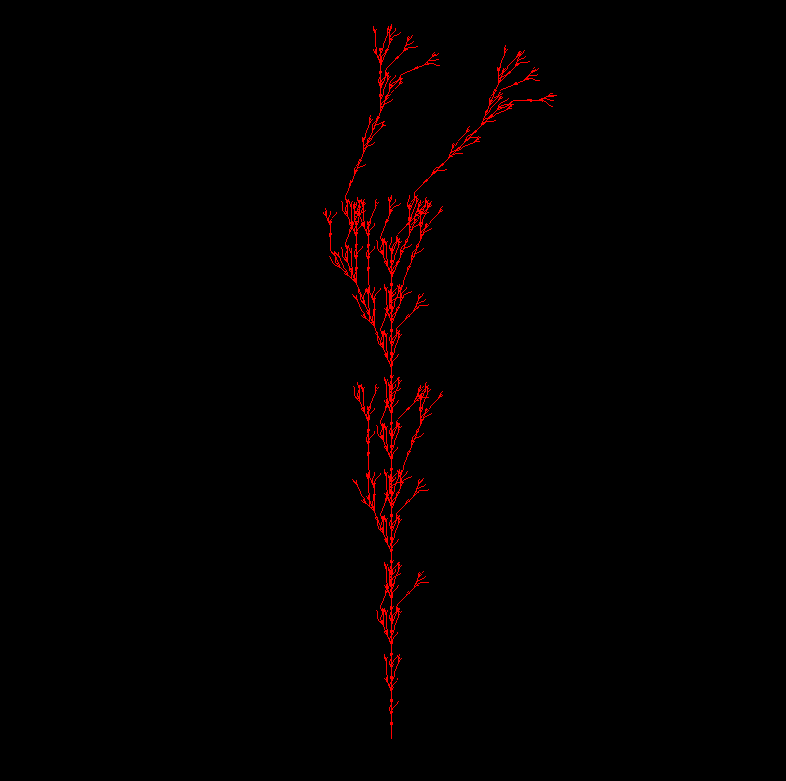
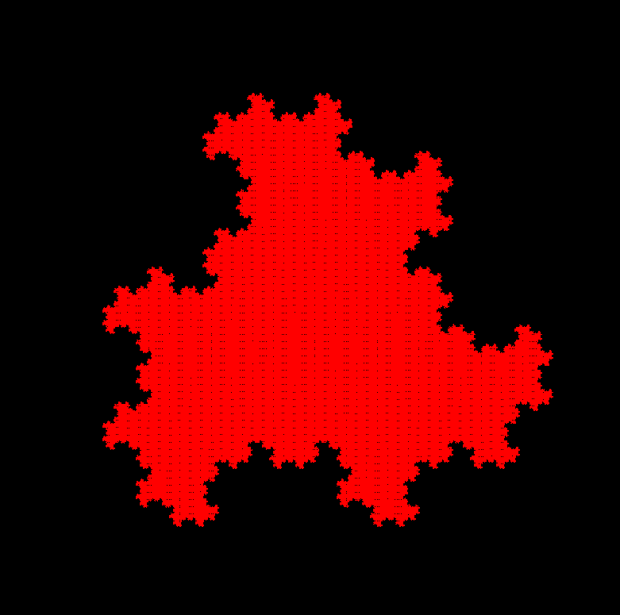
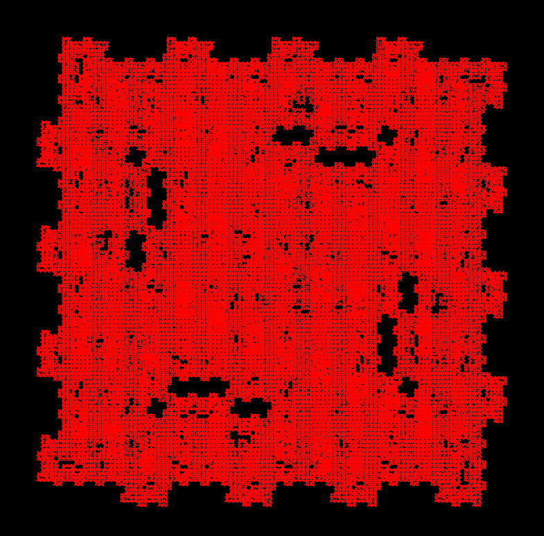

<h1>LSystems and OpenGL</h1>

Coursework. Mentor: Polevoy D. V.

Rules definitions (according to [Paul Bourke](http://www.paulbourke.net/fractals/lsys/)):

| Character | Meaning                                            |
|----------:|----------------------------------------------------|
|         F | Move forward by line length drawing a line         |
|         f | Move forward by line length without drawing a line |
|         + | Turn left by turning angle                         |
|         - | Turn right by turning angle                        |
|        \[ | Push current drawing state onto stack              |
|        \] | Pop current drawing state from the stack           |

<h2>Building</h2>
Dependencies: <br>
1. GLFW <br>
2. GLAD <br>
3. GLM <br>
4. Boost <br>
5. Stb <br><br>


```
cmake -S . build -DCMAKE_TOOLCHAIN_FILE=<path_to_pacman>
cmake --build build --config Release
sudo cmake --install ./build
cd build/
```

<h2>Using</h2>

```
./l_system_drawer -h
```

Available command line keys:

|  Key  | Meaning: format                                 |
|------:|-------------------------------------------------|
| -gen  | Set a number of generations: **integer**        |
| -len  | Set a line length:           **double**         |
| -rot  | Set a rotation angle:        **double**         |
| -axm  | Set an axiom:                **string**         |
| -rule | Set a new rule:              **string->string** |
| -file | Set LSystem from the file:   **filepath**       |
| -save | Set file to save screens:    **filepath**       |

Available keyboard keys:

|  Key  |      Meaning      |
|------:|-------------------|
| W     | Camera up         |
| S     | Camera down       |
| A     | Camera left       |
| D     | Camera right      |
| Q     | Camera zoom       |
| E     | Camera move away  |
| Z     | Take a screenshot |

A composition of configuration .txt file (connected by command ``` -file <absolute_path> ```):

```
<number of generations>
<length of line>
<rotation angle (degrees)>
<axiom>
<rule 1>
<rule 2>
...
<rule N>
```

Example 1. Command as follows...

```
./l_system_drawer -gen 7 -rot 22.5 -axm "F" -rule "F->FF-[XY]+[XY]" -rule "X->+FY" -rule "Y->-FX"
```
... will produce window with this plant:



Example 2. Another one:

```
./l_system_drawer -gen 10 -rot 120 -axm "F+F+F" -rule "F->F-F+F"
```



Example 3. You can specify the absolute path to the configuration file:

```
./l_system_drawer -file "<absolute path to file>"
```



<h2>Documentation</h2>

Technical documentation is [here](https://drive.google.com/file/d/1A3JmN9AcxBZrIPfOS4eLKG3cOu66Ep7f/view?usp=drive_link), generated by [Doxygen](https://github.com/doxygen/doxygen). <br>
You can create documentation yourself, here is a list of possible commands (from install directory <b>bin</b>):
```
doxywizard Doxyfile
cd l_systems_docs/latex
pdflatex refman.tex
```
After these actions, you will have a file <b>```refman.pdf```</b> in this directory.