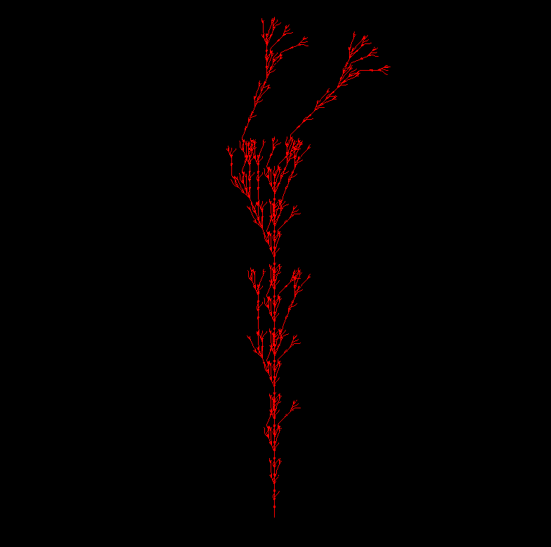
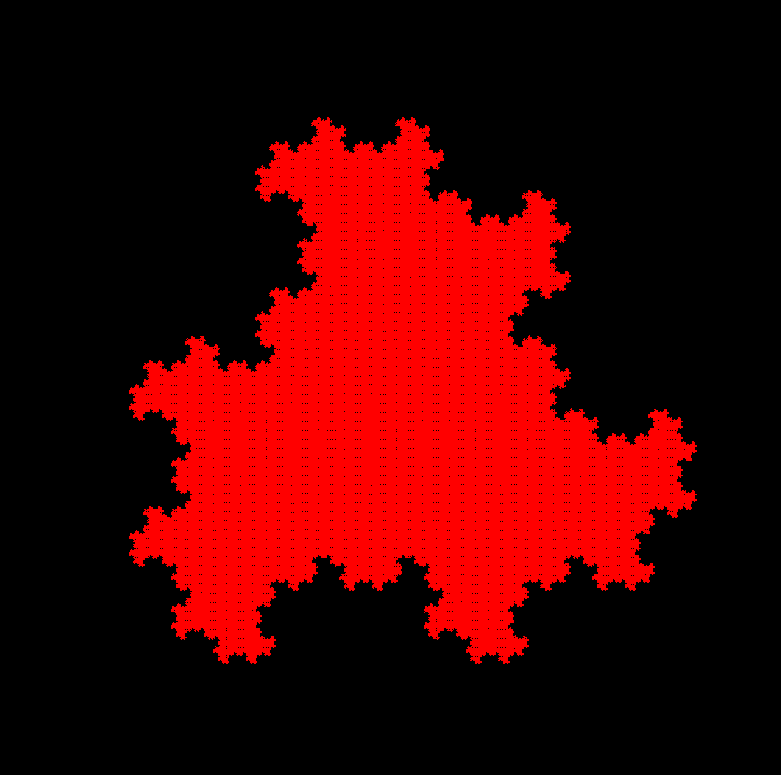

<h1>LSystems and OpenGL</h1>

Coursework. Mentor: Polevoy D. V.

Rules definitions (according to Paul Bourke):

| Character | Meaning                                            |
|----------:|----------------------------------------------------|
|         F | Move forward by line length drawing a line         |
|         f | Move forward by line length without drawing a line |
|         + | Turn left by turning angle                         |
|         - | Turn right by turning angle                        |
|        \[ | Push current drawing state onto stack              |
|        \] | Pop current drawing state from the stack           |

<h3>Building</h3>
Dependencies:
1. GLFW \newline
2. Glad \newline
3. Glm \newline
4. Boost \newline


```
mkdir build
cd build
cmake ..
cmake --build . 
```

<h3>Using</h3>

```
l_system_drawer -h
```

Available command line keys:

|  Key  | Meaning: format                                 |
|------:|-------------------------------------------------|
| -gen  | Set a number of generations: **integer**        |
| -len  | Set a line length:           **double**         |
| -rot  | Set a rotation angle:        **double**         |
| -axm  | Set an axiom:                **string**         |
| -rule | Set a new rule:              **string->string** |
| -file | Set LSystem from the file:   **filepath**       |

A composition of configuration .txt file (connected by command ``` -file <absolute_path> ```):

```
<number of generations>
<length of line>
<rotation angle (degrees)>
<axiom>
<rule 1>
<rule 2>
...
<rule N>
```

Example 1. Command as follows...

```
./l_system_drawer -gen 7 -rot 22.5 -axm "F" -rul "F->FF-[XY]+[XY]" -rul "X->+FY" -rul "Y->-FX"
```
... will produce window with this plant:



Example 2. Another one:

```
./l_system_drawer -gen 10 -rot 120 -axm "F+F+F" -rul "F->F-F+F"
```



Example 3. You can specify the absolute path to the configuration file:

```
./l_system_drawer -file "<absolute path to file>"
```


